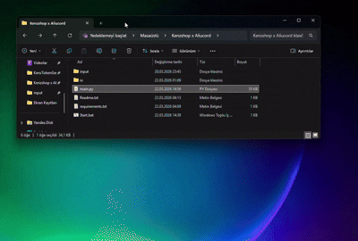
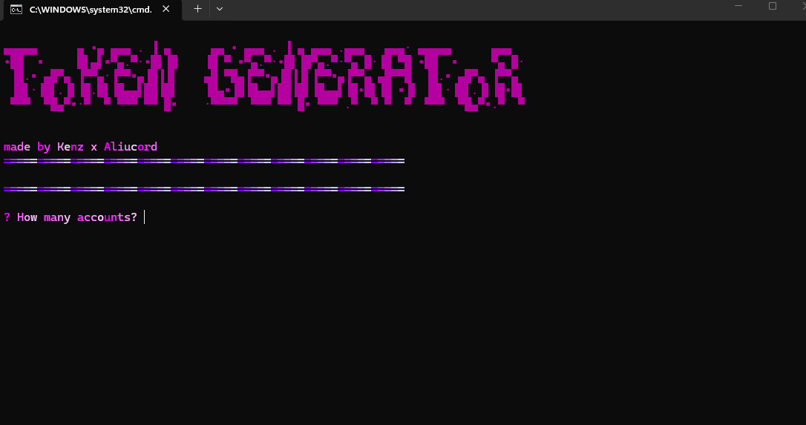
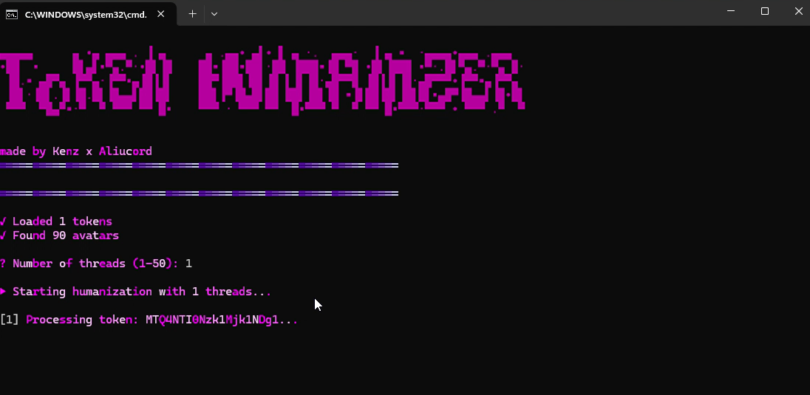

# ⚡ Discord Token Generator

<div align="center">


**Advanced Discord Account Generator & Humanizer Tool**



</div>

---

## 📸 SCREENSHOTS

| Token Generator | Humanizer |
|-----------------|-----------|
|  |  |

---

## 🚀 FEATURES

| Category | Features |
|----------|----------|
| **Token Generator** | • Auto Account Creation<br>• Instant Email Verification <br>• No API Key Required<br>• Random User Agents<br>• Unique Passwords<br>• Y2K Style Usernames<br>• Multi-Account Support<br>• Automatic Saving |
| **Token Humanizer** | • Random Bios<br>• Display Names<br>• Pronouns<br>• Profile Pictures<br>• Hypesquad Selection<br>• Multi-Thread Support (1-50 threads) |
| **UI & Experience** | • Neon Purple/Magenta Theme<br>• Pulsing ASCII Art<br>• Colored Console Output<br>• Progress Tracking |
| **Output Management** | • Token Only Export (tokens.txt)<br>• Full Credentials (token.txt)<br>• Organized input/ folder |

---


# ⭐100 STAR FOR V2📌
# 🚀 V2 FEATURES
- ✅ everything auto
- ✅ Premium mail services
- ✅ phone verifier
- ✅ captcha solver
- ✅ premium joiner
- ✅ premium features
- ✅ more threads


## 📦 INSTALLATION

```bash
# Clone the repository
git clone https://github.com/KenzCybSec/Discord-Token-Generator
cd Discord-Token-Generator

# Install dependencies
pip install -r requirements.txt

# Run the tool
python main.py

##⚙️ CUSTOMIZATION
Create these files in io/input/profiles/:

File	Purpose
bio.txt	Bios (one per line)
names.txt	Display names (one per line)
pronouns.txt	Pronouns (one per line)
avatars/	Profile pictures (.png/.jpg)

##📁 FILE STRUCTURE
text
Discord-Token-Generator/
├── main.py
├── requirements.txt
├── input               # tokens.txt, token.txt
├── io/input/profiles/      # bio.txt, names.txt, pronouns.txt, avatars/
├── images/                 # tokengen.png, humanizer.png
├── videos/                 # KenzxAliucord.gif
└── README.md

##💻 TESTED ON
Windows 10/11 ✅ | Kali Linux ✅ | Ubuntu ✅ | macOS ✅

##📞 SUPPORT
Discord Server: https://discord.gg/6ZseZcYS
Discord Server: https://discord.gg/aliucord
Join for: Free Support • Updates • Help • Feature Requests

##💰 Support
ltc:ltc1qa95js467fh5j3dg3p7u6vs0uupptr2062pluum
ltc:LW3CJpiwF1y2y2SrSBvNF5PezpiGf4PWgw

## ⚠️ DISCLAIMER

**📚 EDUCATIONAL PURPOSES ONLY**

This tool (Discord Token Generator) is developed and distributed SOLELY for educational and research purposes. It is designed to help users understand:

• Discord API architecture and authentication flows
• Browser automation techniques and web scraping
• Email verification systems and temporary email services
• Cybersecurity concepts in controlled environments

---

**🚨 PROHIBITED USES - DO NOT USE THIS TOOL FOR:**

• Creating accounts for spam, harassment, or abuse
• Violating Discord's Terms of Service or Community Guidelines
• Any illegal activities or unauthorized access
• Selling accounts or tokens for profit
• Bypassing platform restrictions or bans
• Any malicious or harmful purposes

---

**⚖️ YOUR LEGAL RESPONSIBILITY**

By using this tool, you acknowledge and agree that:

• You are solely responsible for how you use this tool
• You will only test on accounts you own or have explicit permission to test
• You will comply with all applicable local, state, national, and international laws
• You will respect Discord's Terms of Service and all platform rules
• The developers assume NO liability for any misuse of this tool

---

**📌 IMPORTANT NOTES**

• This tool uses temporary email services (mail.tm) which are public services
• All generated accounts are subject to Discord's verification and moderation
• Accounts created may be flagged or banned if used improperly
• This tool does NOT bypass any security measures or CAPTCHA systems

---

**THE DEVELOPERS ARE NOT RESPONSIBLE FOR ANY DAMAGES, LOSSES, OR LEGAL ISSUES ARISING FROM THE USE OF THIS TOOL. USE AT YOUR OWN RISK.**

By downloading, cloning, or using this tool, you confirm that you have read, understood, and agree to all terms stated above. If you do not agree, do not use this tool.

---

##👥 CREDITS
Made by	KenzShop x Aliucord
Contributors	yeonsieunx

# 📜 LICENSE
MIT License
